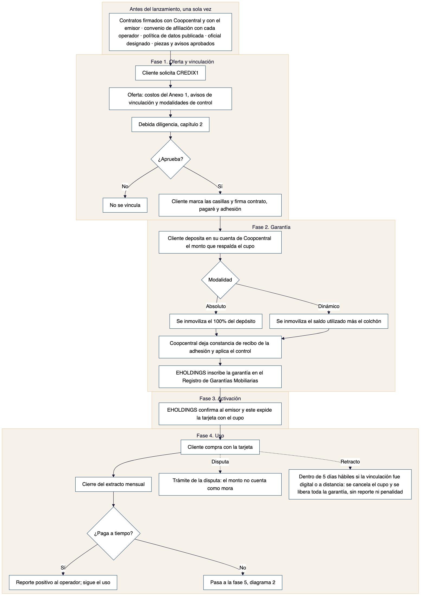
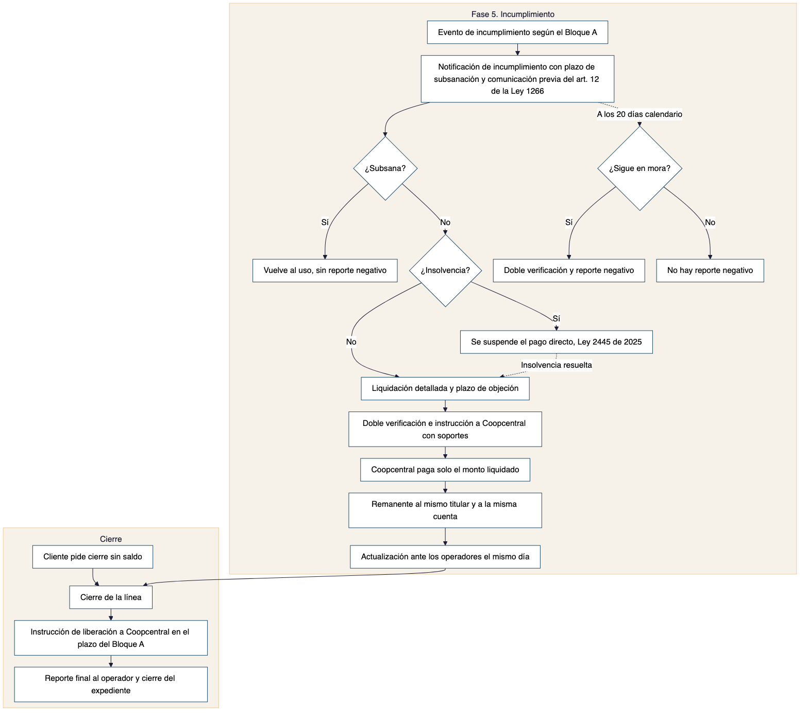
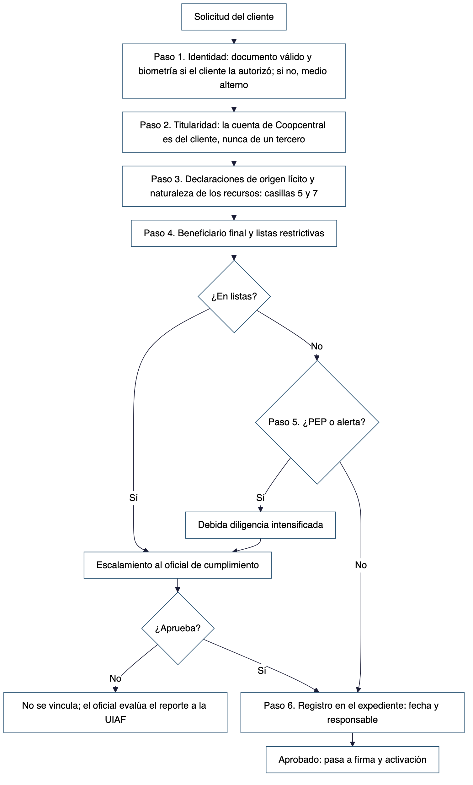

<!-- Nota de diligenciamiento (no se imprime): campos abiertos en los capítulos 3 (evaluación de sujeción y nombre del oficial) y 6 (operadores con convenio). La Guía de entrega, sección 4, los lista con responsable. -->

# 1. Flujo operativo

El flujo cubre la línea de crédito rotativa garantizada. Las líneas de tarjetas corporativas de marca compartida y de financiación en punto de venta con aliados comerciales no hacen parte de este flujo y, si se aprueban, requieren el suyo.

Diagrama 1. Alta y uso.

{height=20cm}

Diagrama 2. Incumplimiento y cierre.

{width=100%}

## Notas del flujo

| Punto | Nota |
|--------|-------------------------------------------------------|
| Antes del lanzamiento | La afiliación como fuente es un requisito previo, no un paso posterior a la activación. Sin convenio vigente con un operador no se le reporta nada (capítulo 2, lista de verificación) |
| Modalidad de control | Es la decisión de estructura más importante del producto (Tesis 2 del concepto jurídico). El control absoluto es una elección comercial, no un requisito legal, y expone al modelo a más riesgo que el control dinámico. Ambas modalidades quedan documentadas como opción del cliente |
| Disputa | Evita que una compra no reconocida se compute como mora mientras se investiga (cláusula octava del contrato del cliente) |
| Retracto | Corre durante los cinco días hábiles siguientes a la celebración, si la vinculación fue digital o a distancia (cláusula novena) |
| Notificación de incumplimiento | Lleva en el mismo envío la comunicación previa del artículo 12 de la Ley 1266 de 2008. Así el plazo de veinte días calendario corre en paralelo con la subsanación y la objeción |
| Insolvencia | La Ley 2445 de 2025 suspende los descuentos automáticos sobre productos financieros al aceptarse un trámite de insolvencia de persona natural no comerciante. La garantía no se ejecuta mientras esa suspensión esté vigente, salvo que el incumplimiento ya fuera cierto y estuviera avisado antes de la radicación |
| Liquidación y objeción | Es lo que permite superar el control de cláusulas abusivas al que el artículo 62-1 de la Ley 1676 de 2013 somete el pago directo |
| Ejecución | No requiere proceso judicial. Coopcentral paga con los recursos ya controlados, solo por el monto liquidado, con los soportes de la cláusula quinta del contrato marco |
| Reporte negativo | Solo si la obligación sigue en mora al vencer los veinte días calendario. Si ya se extinguió por pago directo, no se reporta mora y se actualiza el mismo día. El reporte positivo del pago puntual no requiere aviso |

# 2. Vinculación y debida diligencia

## 2.1 Alcance

Aplica a todo cliente que solicite CREDIX1, con independencia de que EHOLDINGS resulte o no sujeta formalmente al Capítulo IX de la Circular Básica Jurídica de la Superintendencia de Sociedades (Circular Externa 100-000020 de 2026). Se ejecuta antes de la firma y de la activación del cupo.

## 2.2 Pasos

Diagrama 3. Debida diligencia.

{height=19cm}

1. Identidad: documento válido. La validación biométrica se usa solo si el cliente la autorizó en la casilla 11 del Anexo 2 del contrato; si no la autorizó, se aplica el medio alterno de la sección 6 de la política de datos. La vinculación no se condiciona a la biometría (artículo 6 del Decreto 1377 de 2013).
2. Titularidad: el cliente es el titular de la cuenta de ahorros en Coopcentral sobre la que se constituye la garantía. Nunca un tercero (cláusula décima cuarta del contrato del cliente).
3. Declaraciones: origen lícito de los fondos y naturaleza de los recursos (casillas 5 y 7).
4. Beneficiario final, cuando aplique, y consulta de listas restrictivas: Consejo de Seguridad de Naciones Unidas, OFAC y listas de conocimiento público.
5. Condición de persona expuesta políticamente del cliente, de sus familiares hasta el segundo grado de consanguinidad o primero de afinidad, o de sus asociados conocidos. Si aplica, o si hay una señal de alerta, se activa la diligencia intensificada.
6. Registro del resultado en el expediente del cliente, con fecha y responsable.

## 2.3 Señales de alerta propias del producto

- Depósitos fraccionados por debajo de los umbrales de reporte a la UIAF.
- Terceros no relacionados con el cliente que fondean o abonan a la cuenta objeto de la garantía.
- Compras con la tarjeta seguidas de pago inmediato del extracto, sin evidencia de uso real del bien o servicio adquirido.
- Cierre de la línea y retiro de los recursos inmediatamente después de obtener el primer reporte positivo.
- Solicitudes de cupos máximos por clientes sin actividad económica verificable.
- Vinculación de varios clientes con datos de contacto, dispositivo o dirección IP coincidentes.

## 2.4 Escalamiento

Toda señal de alerta, coincidencia en listas o condición de persona expuesta políticamente se escala al oficial de cumplimiento antes de activar el cupo:

1. El oficial evalúa el caso y, si corresponde, activa la diligencia intensificada.
2. El oficial decide si se vincula o no al cliente y si la operación amerita reporte a la UIAF conforme al capítulo 3.
3. Si se vincula, el cliente queda en seguimiento reforzado durante los primeros seis meses.

## 2.5 Diligencia intensificada

Incluye verificación reforzada del origen de los fondos con soporte documental, aprobación del oficial de cumplimiento antes de activar el cupo y monitoreo con frecuencia mayor a la estándar durante los primeros seis meses.

## 2.6 Devoluciones

Toda devolución de recursos al cliente, por cancelación, retracto, liberación de garantía, excedente del control dinámico o remanente del pago directo, se hace únicamente a la misma cuenta de origen y al mismo titular. Nunca a un tercero ni en efectivo.

## 2.7 Lista de verificación de afiliación como fuente de información

Antes de reportar el primer dato de cualquier cliente a un operador, EHOLDINGS tiene completos estos puntos frente a ese operador:

- [ ] Convenio de afiliación como fuente suscrito con el operador, en el formato que el operador exija.
- [ ] Requisitos técnicos de integración y formato de reporte confirmados.
- [ ] Canal de atención al titular habilitado (sección 12 de la política de datos) y comunicado al operador.
- [ ] Validación con el operador de que la naturaleza del producto (cupo garantizado, sin entrega de efectivo) no genera objeciones.
- [ ] Procedimiento de calidad del dato del capítulo 4 en operación.
- [ ] Mecanismo de actualización el mismo día de obligaciones extinguidas por pago directo, verificado con el operador.
- [ ] Plazos y costos de afiliación confirmados y presupuestados.

# 3. Prevención de lavado de activos, financiación del terrorismo y de la proliferación

## 3.1 Adopción voluntaria

EHOLDINGS evaluó su sujeción al Capítulo IX de la Circular Básica Jurídica de la Superintendencia de Sociedades (Circular Externa 100-000020 del 2 de julio de 2026), conforme al umbral de 4.929.017 UVB de ingresos totales o activos al 31 de diciembre del año anterior.

Resultado de la evaluación: [CIFRAS DE EHOLDINGS Y CONCLUSIÓN SOBRE SUJECIÓN FORMAL].

Con independencia de ese resultado, EHOLDINGS adopta este programa de forma voluntaria, porque CREDIX1 presenta una tipología reconocida por el Grupo de Acción Financiera Internacional (GAFI): convertir dinero sin origen acreditado en historial crediticio limpio y consumo bancarizado. El glosario de las Recomendaciones del GAFI define "instituciones financieras" por la actividad, incluido el otorgamiento de crédito, y no por el estatus regulatorio.

## 3.2 Oficial de cumplimiento

EHOLDINGS designa a [NOMBRE DEL OFICIAL DE CUMPLIMIENTO] como oficial de cumplimiento, responsable de ejecutar este programa, evaluar las señales de alerta y los casos escalados del capítulo 2, decidir los reportes a la Unidad de Información y Análisis Financiero (UIAF) y servir de contraparte del programa de prevención de lavado de activos de Coopcentral.

## 3.3 Matriz de riesgo por factores

| Factor | Nivel típico | Consideración |
|--------|--------|---------------------------------------------------|
| Cliente | Medio | Persona natural sin historial crediticio o con historial dañado; verificar consistencia entre el monto depositado y el perfil económico declarado |
| Producto | Medio-alto | Genera por diseño un reporte positivo a cambio de un depósito controlado, atractivo para quien busca trazabilidad financiera sin necesitar el crédito |
| Canal | Variable | Mayor riesgo en canales digitales sin verificación reforzada de identidad |
| Jurisdicción | Bajo-medio | Producto ofrecido dentro de Colombia; reevaluar si se ofrece a clientes con vínculos en jurisdicciones de mayor riesgo |

## 3.4 Señales de alerta generales

Se suman a las señales propias del producto de la sección 2.3:

- Transacciones estructuradas para evadir umbrales de reporte.
- Clientes reticentes a explicar el origen de los fondos.
- Urgencia inusual para activar el cupo o cerrar la relación.
- Referidos entre clientes que comparten datos de contacto o dispositivo.

## 3.5 Reporte de operaciones sospechosas

Si una señal de alerta, tras el análisis del oficial, no logra explicarse razonablemente, EHOLDINGS reporta la operación sospechosa a la UIAF. El cliente no es informado del reporte. El análisis y el reporte se conservan en el expediente interno del caso.

## 3.6 Relación con Coopcentral

El programa de prevención de lavado de activos de Coopcentral prevalece sobre cualquier instrucción de EHOLDINGS, conforme a la cláusula décima segunda del contrato marco de garantía mobiliaria de control. EHOLDINGS comparte con Coopcentral la información que ese contrato o la ley exijan y atiende sus requerimientos.

## 3.7 Capacitación, actualización y revisión de sujeción

El oficial capacita al menos una vez al año al personal que interviene en la vinculación, el uso y la cobranza del producto.

EHOLDINGS actualiza este capítulo cuando cambie el Capítulo IX de la Circular Básica Jurídica o cualquier otra norma aplicable, y revisa al cierre de cada ejercicio si supera el umbral de sujeción. Si la sujeción se activa, ajusta el programa al régimen formal dentro del plazo de transición que fije la circular.

# 4. Reporte a centrales de riesgo

Los canales y plazos de atención al titular (consultas, reclamos, leyenda "reclamo en trámite") y el protocolo de suplantación están en las secciones 12 y 13 de la política de datos. Este capítulo no los repite.

## 4.1 Periodicidad

El reporte se hace mensualmente, con corte al cierre del extracto de cada cliente, y solo a operadores con convenio vigente (sección 2.7).

## 4.2 Qué se reporta

| Situación | Regla |
|--------|-------------------------------------------------------|
| Pago puntual | Dato positivo, sin aviso previo |
| Mora | Dato negativo solo transcurridos veinte días calendario desde el envío de la comunicación previa al último domicilio registrado (artículo 12 de la Ley 1266 de 2008). Si la obligación es igual o inferior al quince por ciento de un salario mínimo legal mensual vigente, además, al menos dos comunicaciones en días diferentes, con veinte días calendario entre la última y el reporte (artículo 13, parágrafo 2, modificado por la Ley 2157 de 2021) |
| Monto en disputa | No se computa como mora mientras la disputa esté en trámite |
| Retracto | No se reporta nada derivado del contrato |
| Cierre | Estado final: cancelado al día, cancelado con saldo pagado tras ejecución de la garantía u otro que corresponda |

## 4.3 Actualización el mismo día

Toda obligación que se extinga, incluida la que se paga con la garantía, se actualiza ante los operadores el mismo día del hecho, no en el corte siguiente. Ningún reporte de mora queda vigente después de que la obligación se extinguió por pago directo.

## 4.4 Permanencia y caducidad

El dato negativo permanece el doble del tiempo que duró la mora, con un máximo de cuatro años desde el pago de las cuotas vencidas o la extinción de la obligación, y caduca en todo caso a los ocho años desde que la obligación entró en mora (artículo 13 de la Ley 1266 de 2008, modificado por la Ley 2157 de 2021). EHOLDINGS retira el dato al cumplirse cualquiera de los dos términos, sin esperar solicitud del titular.

## 4.5 Calidad del dato

Antes de cada reporte se verifica que monto del cupo, saldo, fecha de pago y estado correspondan exactamente al extracto emitido. Toda inconsistencia se corrige antes de reportar.

## 4.6 Doble verificación previa al reporte negativo

Ningún reporte negativo se envía sin que dos personas distintas de EHOLDINGS verifiquen, con registro fechado, que se cumplieron la comunicación previa, el plazo de veinte días, el plazo de subsanación y la liquidación. Ese registro es el expediente de defensa ante una tutela, en la que la carga de probar la comunicación previa recae en la fuente.

# 5. Cobranza

## 5.1 Marco y alcance

La Ley 2300 de 2023 regula los canales, el horario y la periodicidad del contacto de cobranza. Aplica a EHOLDINGS y a cualquier tercero que gestione cobranza por su cuenta, tercerizada o por cesión. Su incumplimiento lo sanciona la Superintendencia de Industria y Comercio (artículo 9). La regla contractual frente al cliente está en la cláusula vigésima primera del contrato del cliente.

## 5.2 Canales

Solo se usan los canales que el cliente autorizó en el Bloque B del contrato (artículo 2): llamada, mensaje de texto, correo electrónico o aplicación.

No se hacen visitas de cobranza al domicilio ni al lugar de trabajo del cliente (artículo 6). La única excepción aplicable a CREDIX1 es la del parágrafo 2 de ese artículo: que EHOLDINGS no tenga información actualizada de los canales autorizados y los operadores de telefonía o mensajería reporten imposibilidad de contacto, todo documentado en el registro de la sección 5.5.

## 5.3 Horario y periodicidad

- Lunes a viernes de 7:00 a. m. a 7:00 p. m. y sábados de 8:00 a. m. a 3:00 p. m. Ningún contacto los domingos ni los festivos (artículo 3).
- Establecido un contacto directo con el cliente, no se le vuelve a contactar el mismo día ni por varios canales dentro de la misma semana (artículo 3).
- Si el cliente pide ser contactado en otro horario, debe manifestarlo expresamente en un documento distinto del contrato y posterior a su firma (artículo 3, parágrafo).

## 5.4 Prohibiciones

- Contactar a las referencias personales o de otra índole del cliente (artículo 4).
- Consultar al cliente el motivo del incumplimiento. Sí se le pueden ofrecer alternativas de pago acordes con su situación (artículo 7).
- Usar un tono intimidante o sugerir consecuencias distintas de las previstas en el contrato: aviso de incumplimiento, plazo de subsanación, liquidación, pago directo y reporte a centrales.

## 5.5 Guion y trazabilidad

Todo contacto sigue un guion aprobado por el área legal de EHOLDINGS que identifica a quien llama y a nombre de quién cobra, informa el monto exacto adeudado y la fecha de origen de la mora, recuerda el plazo de subsanación y sus consecuencias, e informa el canal de queja ante la Superintendencia de Industria y Comercio si el cliente lo pide.

Cada contacto se registra con fecha, hora, canal, persona que contacta y resultado. Ese registro es la evidencia ante una queja o una auditoría.

## 5.6 Cobranza tercerizada

El contrato con el tercero incorpora como cláusula espejo todas las reglas de este capítulo y lo obliga como encargado del tratamiento (sección 7 de la política de datos). EHOLDINGS audita su cumplimiento cada trimestre.

## 5.7 Relación con el pago directo

La cobranza opera antes del pago directo y busca el pago voluntario dentro del plazo de subsanación de la cláusula séptima del contrato del cliente.

# 6. Publicidad y avisos al cliente

## 6.1 Marco

Los artículos 23, 24, 29, 30 y 50 de la Ley 1480 de 2011 exigen que la información y la publicidad dirigidas al consumidor sean veraces, suficientes y comprobables. La Superintendencia de Industria y Comercio sancionó a una fintech no vigilada (Resolución 2972 de 2024, Nanocred Colombia S.A.S.) por publicidad engañosa junto con usura e infracción al deber de información.

El riesgo propio de CREDIX1 es prometer que "repara" o "mejora" el puntaje. El puntaje lo calcula cada operador con su propio modelo. Los estudios del Consumer Financial Protection Bureau y de la Reserva Federal de Estados Unidos sobre productos constructores de crédito muestran que ayudan más a quien no tiene deuda vigente que a quien ya está endeudado, que es el segmento de CREDIX1.

## 6.2 Expresiones prohibidas

- "Borramos su reporte" o cualquier variación que sugiera eliminar información negativa preexistente.
- "Salga de las centrales de riesgo" o "limpie su historial".
- "Mejoramos su puntaje" o "le garantizamos un mejor puntaje", como promesa de resultado.
- "Aprobación garantizada" para cualquier crédito futuro.
- Cualquier expresión que sugiera que EHOLDINGS es vigilada, recibe depósitos, administra ahorros u ofrece rendimiento sobre el dinero del cliente.
- El uso de la marca o el logo de Coopcentral sin autorización expresa y previa del banco.

\newpage

## 6.3 Avisos obligatorios y dónde va cada uno

| Momento | Dónde | Texto |
|--------|--------|-------------------------------------------------|
| Publicidad y precontractual | Toda pieza que mencione el efecto sobre el historial, legible y no diluido en letra pequeña | CREDIX1 reporta su comportamiento de pago a [OPERADORES DE INFORMACIÓN CON CONVENIO VIGENTE]. El puntaje lo calcula cada operador con su propio modelo, que EHOLDINGS no controla. CREDIX1 no garantiza una mejora determinada del puntaje, la aprobación de créditos futuros ni la eliminación de reportes negativos de otras fuentes. |
| Vinculación | Pantalla o formulario de vinculación, antes de las casillas | EHOLDINGS FLORIDA S.A.S. no es una entidad vigilada por la Superintendencia Financiera de Colombia y sus obligaciones no están amparadas por el seguro de depósitos de Fogafín. La única entidad vigilada del esquema es Banco Cooperativo Coopcentral, respecto de su cuenta de ahorros. El cupo está respaldado por su propio dinero, depositado en esa cuenta bajo una garantía mobiliaria de control: no lo recibe en efectivo y no puede disponer libremente de él mientras la garantía esté vigente. Si no paga, tras el aviso y la oportunidad de objetar, la garantía puede ejecutarse y la mora puede reportarse. Quejas frente a EHOLDINGS: Superintendencia de Industria y Comercio. Frente a Coopcentral: su Defensor del Consumidor Financiero y la Superintendencia Financiera. Si se vincula por canal digital o a distancia, puede retractarse dentro de los cinco días hábiles siguientes, sin costo. |
| Uso | Cada extracto mensual | Tasa efectiva anual vigente, calculada sobre todos los cobros del Anexo 1. El pago puntual se reporta como dato positivo; la mora, previo aviso, como dato negativo. La cobranza solo se hace por los canales que usted autorizó y en los horarios de la Ley 2300 de 2023. |
| Cierre | Confirmación de cierre | EHOLDINGS libera el control sobre los recursos remanentes en el plazo pactado, una vez no exista saldo pendiente, y reporta el estado final al operador. |

## 6.4 Aprobación de piezas

Ninguna pieza se publica sin que el área legal verifique, con esta lista, que:

1. No usa ninguna expresión de la sección 6.2.
2. Incluye el aviso de publicidad de la sección 6.3.
3. Toda afirmación objetiva (cifras de clientes, porcentajes de mejora) tiene sustento documental verificable y conservado.
4. Identifica correctamente a EHOLDINGS, al emisor y a Coopcentral, conforme a la casilla 10 del Anexo 2 del contrato del cliente.

## 6.5 Sustento de afirmaciones objetivas

EHOLDINGS mide y conserva, como sustento de cualquier afirmación sobre el efecto del producto, el porcentaje de clientes cuyo comportamiento reportado mejora en doce meses, la tasa de incumplimiento y la tasa de graduación hacia cupo no garantizado (artículo 30 de la Ley 1480 de 2011). No es una obligación de divulgación pública.

## 6.6 Revisión posterior

Si un cliente o un tercero cuestiona una pieza publicada, el área legal la retira o corrige dentro de las veinticuatro horas siguientes mientras evalúa el fondo, y deja registro de la evaluación y de la decisión.

# 7. Metodología de la tasa

## 7.1 Fuente

La Superintendencia Financiera de Colombia certifica cada mes la tasa de usura y el interés bancario corriente por modalidad de crédito: consumo y ordinario, consumo de bajo monto y productivo. CREDIX1 se liquida bajo la modalidad de crédito de consumo y ordinario, la misma que cita la cláusula cuarta del contrato del cliente.

## 7.2 Procedimiento mensual

1. El área financiera consulta la certificación vigente el primer día hábil de cada mes.
2. Calcula la tasa efectiva anual total del producto, sumando todos los conceptos del Anexo 1 del contrato del cliente.
3. Si la tasa efectiva anual total supera el tope certificado, la ajusta a la baja desde el primer día del mes, sin consentimiento adicional del cliente, conforme a la cláusula cuarta.
4. Deja registro fechado de la consulta, el cálculo y el ajuste.

## 7.3 Ejemplo ilustrativo

Con cifras hipotéticas: si la tasa de usura certificada fuera 28,9 % efectivo anual y EHOLDINGS fijara su tasa total un punto por debajo, la tasa efectiva anual total sería 27,9 %. Este ejemplo no se copia al contrato ni a la publicidad: el porcentaje cambia cada mes.

## 7.4 El techo penal

El techo no se calcula sumando un margen sobre la tasa certificada. La certificación ya es el resultado de multiplicar por 1,5 el interés bancario corriente, y esa cifra es el techo del artículo 305 del Código Penal. Cobrar por encima de ella consuma el delito de usura desde el primer peso.

## 7.5 Registro

EHOLDINGS conserva el historial mensual de certificaciones consultadas, cálculos y ajustes, como evidencia de cumplimiento del tope de usura.

# 8. Fundamento jurídico de las casillas de aceptación

Cada casilla del Anexo 2 del contrato del cliente se presenta por separado y ninguna viene premarcada.

| Casilla | Fundamento |
|--------------|--------------------------------------------------|
| 1. Tratamiento de datos | Ley 1581 de 2012 y Decreto 1377 de 2013: autorización previa, expresa e informada |
| 2. Reporte a centrales | Ley 1266 de 2008, modificada por la Ley 2157 de 2021: autorización distinta y adicional de la general de datos |
| 3. Condiciones del crédito | Ley 1480 de 2011 y Decreto 1368 de 2014: aceptación informada de las condiciones económicas, requisito de validez y de oponibilidad frente al cliente |
| 4. Constitución de la garantía | Ley 1676 de 2013, artículos 3, 9, 14 y 34: contrato escrito con consentimiento expreso del garante sobre el bien y el alcance del control |
| 5. Origen lícito | Debida diligencia frente al riesgo de lavado de activos, alineada con Coopcentral y con el capítulo 3 |
| 6. Comprensión de la inmovilización | Defensa frente a una queja por desequilibrio contractual ante la Superintendencia de Industria y Comercio y frente a una denuncia por estafa (artículo 246 del Código Penal): acredita consentimiento informado sobre el efecto económico |
| 7. Naturaleza de los recursos | Sustenta, frente a la Sentencia C-145 de 2018, la constitución de la garantía sin verificación judicial previa, y reduce el riesgo de tutela por mínimo vital |
| 8. Pago directo | El artículo 62-1 de la Ley 1676 de 2013 somete el pago directo al régimen de cláusulas abusivas; una aceptación aislada y en lenguaje llano supera ese control |
| 9. Sin garantía de puntaje | Artículos 29 y 30 de la Ley 1480 de 2011; mitigante frente al precedente de la Resolución 2972 de 2024 |
| 10. Identificación de las entidades | Mitigante frente a la apariencia de actividad financiera vigilada (Tesis 8 del concepto jurídico) |
| 11. Datos biométricos, voluntaria | Artículos 5 y 6 de la Ley 1581 de 2012 y artículo 6 del Decreto 1377 de 2013: los biométricos son sensibles, requieren autorización explícita y ninguna actividad puede condicionarse a ella |

En la vinculación digital, las casillas 6, 7, 9 y 10 muestran su texto completo junto a la marca, sin necesidad de abrir un enlace.

# Control de versiones

| Versión | Fecha | Cambios | Estado |
|-----------|------------|-----------------------------------------------------|---------------|
| 1.0 | 12 a 14 de septiembre de 2026 | Ocho documentos separados: flujograma, procedimiento de debida diligencia, manual de prevención de lavado de activos, manual de reporte a centrales, política de cobranza, política de publicidad, avisos por fase y parte B del anexo de costo | Reemplazada |
| 2.0 | 5 de octubre de 2026 | Un solo manual con un capítulo por proceso. Flujograma redibujado: la afiliación como fuente pasa a requisito previo, la comunicación previa del reporte negativo sale con la notificación de incumplimiento, el reporte negativo solo procede si la mora subsiste a los veinte días, y se corrige el tramo que dejaba desconectada la activación. Biometría voluntaria con medio alterno (artículo 6 del Decreto 1377 de 2013). Cobranza corregida conforme a los artículos 2, 3, 4, 6 y 7 de la Ley 2300 de 2023: se elimina el tope de diez contactos semanales, se prohíben las visitas y se limita a los canales autorizados. Modalidad de consumo y ordinario. Ejemplo de tasa marcado como hipotético. Señales, escalamiento y devoluciones en un solo lugar | Vigente |
