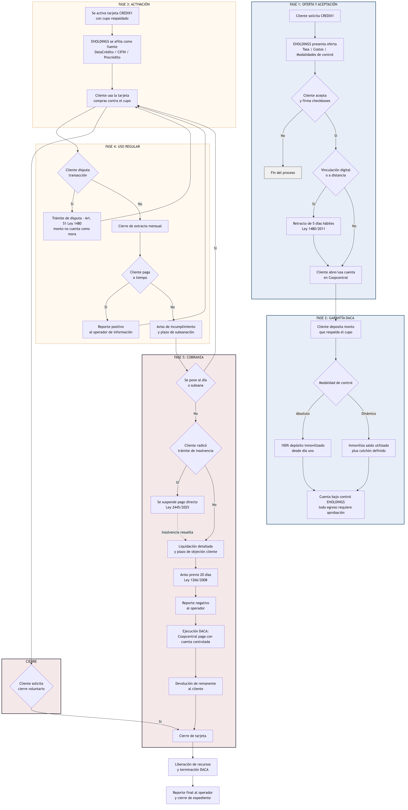

# Flujograma operativo — CREDIX1 (línea de reparación de historial crediticio)
Cubre la línea de tarjeta de crédito rotativa garantizada, con las salvaguardas que incorporó la revisión de brechas del concepto jurídico (control dinámico, retracto, suspensión por insolvencia, disputa de transacciones). Las líneas de tarjetas corporativas de marca compartida y financiación en punto de venta con aliados comerciales no hacen parte de este flujo y, si se aprueban, requieren su propio flujograma.

## Notas del flujo

### Punto E2 — Modalidades de control

El punto E2 es la decisión de estructura más importante del producto (Tesis 2 del concepto jurídico).

El control absoluto es una elección comercial, no un requisito legal, y expone al modelo a más riesgo que el control dinámico. Ambas modalidades quedan documentadas como opción del cliente.

### Punto J2 — Disputa de transacciones

La disputa de transacciones evita que una compra no reconocida por el cliente se compute como mora mientras se investiga.

### Punto O2 — Suspensión por insolvencia

Este es un punto de control nuevo. La **Ley 2445 de 2025** suspende los descuentos automáticos sobre productos financieros al aceptarse un trámite de insolvencia de persona natural no comerciante.

El DACA no puede ejecutarse mientras esa suspensión esté vigente, salvo que el incumplimiento ya fuera cierto y estuviera avisado antes de la radicación.

### Punto P — Liquidación y objeción

La liquidación y objeción es lo que permite superar el control de cláusulas abusivas al que el artículo 62-1 de la **Ley 1676 de 2013** somete el pago directo.

### Punto P2 — Aviso previo para reportes negativos

El aviso previo solo aplica a reportes negativos (mora). El reporte positivo de pagos puntuales (M) no requiere aviso previo.

### Punto R — Ejecución del DACA

La ejecución del DACA no requiere proceso judicial. Coopcentral, por instrucción contractual previa, paga directamente con los recursos ya controlados, únicamente por el monto de la liquidación del punto P.
---
*Elaborado por Bedrock S.A.S. para EHOLDINGS FLORIDA S.A.S.*
