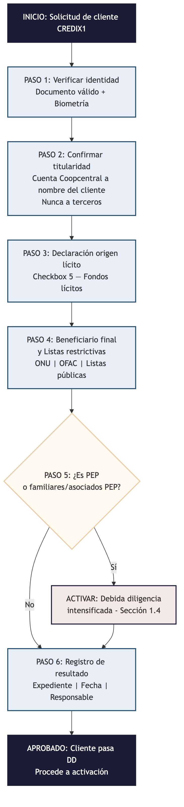

# Procedimiento de debida diligencia de cliente y checklist de afiliación como fuente de información

CREDIX1

## 1. Debida diligencia de cliente y origen de fondos

### 1.1 Alcance

Aplica a todo cliente que solicite la línea de crédito CREDIX1, con independencia de que EHOLDINGS resulte o no sujeta formalmente al Capítulo IX de la Circular Básica Jurídica de la Superintendencia de Sociedades (**Circular Externa 100-000020 de 2026**).

Este procedimiento se ejecuta antes de activar el cupo del cliente y se complementa con el manual de prevención de lavado de activos, financiación del terrorismo y financiación de la proliferación de armas de destrucción masiva (LA/FT/FP) de EHOLDINGS.

### 1.2 Pasos mínimos

El procedimiento de debida diligencia ejecuta estos pasos:

1. **Verificación de identidad:** documento válido y validación biométrica del cliente.
2. **Confirmación de titularidad:** el cliente es el titular de la cuenta de ahorros en Coopcentral sobre la que se constituirá la garantía. Nunca un tercero. (Cláusula décima cuarta del contrato de línea de crédito.)
3. **Declaración de origen lícito:** de los fondos que se depositarán (checkbox 5 del documento de aceptación).
4. **Identificación del beneficiario final:** cuando aplique, y consulta de listas restrictivas.
   - Consejo de Seguridad de Naciones Unidas.
   - OFAC.
   - Listas de conocimiento público antes de vincular.
5. **Verificación de condición PEP:** si el cliente, sus familiares hasta el segundo grado de consanguinidad o primero de afinidad, o sus asociados conocidos son personas expuestas políticamente. Si aplica, se activa la debida diligencia intensificada de la sección 1.4.
6. **Registro:** del resultado de la verificación en el expediente del cliente, con fecha y responsable.

#### Diagrama del procedimiento

### 1.3 Señales de alerta propias del producto

Las siguientes señales deben generar atención especial:

- Depósitos fraccionados por debajo de los umbrales de reporte a la UIAF.
- Terceros no relacionados con el cliente que fondean o abonan a la cuenta objeto de la garantía.
- Patrones de consumo con la tarjeta seguidos de pago inmediato del extracto, sin evidencia de uso real del bien o servicio adquirido.
- Cierre de la línea de crédito y retiro de los recursos inmediatamente después de obtener el primer reporte positivo a centrales de riesgo.
- Solicitudes de cupos máximos por parte de clientes sin actividad económica verificable.
- Patrones de vinculación de múltiples clientes con datos de contacto, dispositivo o dirección IP coincidentes.

#### Protocolo de escalamiento

Cualquier señal de alerta activa inmediatamente el protocolo de escalamiento:

1. Se reporta al oficial de cumplimiento de EHOLDINGS para evaluación.
2. Si la señal se confirma, se activa DD intensificada (sección 1.4).
3. El oficial analiza si la operación es realmente sospechosa.
4. Si se confirma sospecha, se reporta a la UIAF conforme al manual LA/FT/FP.
5. Seguimiento continuo durante los primeros seis meses (cuando está vigente DD intensificada).

### 1.4 Debida diligencia intensificada

Se activa frente a:

- Personas expuestas políticamente, sus familiares y asociados.
- Cualquier cliente que active una o más señales de alerta de la sección 1.3.

Incluye:

- Verificación reforzada del origen de fondos con soporte documental.
- Aprobación del oficial de cumplimiento antes de activar el cupo.
- Monitoreo con frecuencia mayor a la estándar durante los primeros seis meses de la relación.

### 1.5 Restricciones sobre la devolución de recursos

Cualquier devolución de recursos al cliente (por cancelación, retracto, liberación de garantía o excedente bajo control dinámico) se realiza únicamente a:

- La misma cuenta de origen.
- Al mismo titular.

Nunca a un tercero ni en efectivo.

### 1.6 Escalamiento

Cualquier señal de alerta se escala al oficial de cumplimiento de EHOLDINGS antes de activar el cupo del cliente.

El oficial de cumplimiento decide si el caso amerita reporte de operación sospechosa a la **Unidad de Información y Análisis Financiero (UIAF)**, conforme al manual de prevención LA/FT/FP.

## 2. Checklist de afiliación como fuente de información

Antes de reportar el primer pago de cualquier cliente, EHOLDINGS debe tener completos los siguientes puntos frente a cada operador con el que decida afiliarse.

### Requisitos de afiliación

- [ ] Convenio de afiliación como fuente de información suscrito con el operador (DataCrédito Experian, CIFIN-TransUnion y/o Procrédito).
- [ ] Requisitos técnicos de integración y formato de reporte confirmados con el operador.
- [ ] Canal de atención al titular habilitado y comunicado al operador, conforme a la **Ley 1266 de 2008**.
- [ ] Validación con el operador de que la naturaleza del producto (cupo garantizado, sin entrega de efectivo) no genera objeciones para la afiliación.
- [ ] Procedimiento interno de calidad del dato antes de cada reporte mensual, conforme al manual de reporte a centrales de riesgo.
- [ ] Mecanismo de actualización simultánea de obligaciones extinguidas por pago directo, verificado con el operador.
- [ ] Plazos y costos de afiliación confirmados y presupuestados.

---

*Elaborado por Bedrock S.A.S. para EHOLDINGS FLORIDA S.A.S.*
